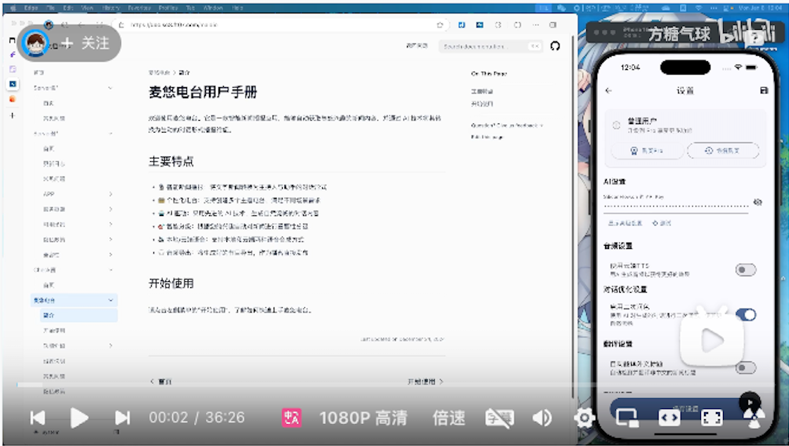

# Getting Started

## Step 0: Install the App

1. iOS users: [Install from AppStore](https://apps.apple.com/app/id6739451274)
2. Android users: [Download APK](https://the7.ft07.com/Maidio/maidio-byok-1.0.9-b29.apk) (v1.0.9) and install manually

For a complete tutorial: [Watch on Bilibili](https://www.bilibili.com/video/BV1XFrjYGEh4)

## Step 1: Set up AI API Key

1. Click the "Settings" tab in the top navigation bar
2. Find the "AI Settings" section on the settings page
3. Enter your API Key from AI platforms:

   - [OpenAI](https://platform.openai.com/api-keys)

4. Click "Save" to complete the setup

## Step 2: Voice Settings

1. Open the app and click the "Voice" tab in the top navigation bar
2. On the "Local Voice" page:
   - Select voice engines for host and assistant
   - Adjust speech rate, pitch, and volume
   - Click the "Voice" button to preview the effect
3. For Android systems:
   - Install Chinese voice packages in system settings first
   - Recommended to use [Xiaomi](https://www.52pojie.cn/thread-1683594-1-1.html) and [Google](https://play.google.com/store/apps/details?id=com.google.android.voiceservices) voice engines
   - Select appropriate Chinese voices
4. For iOS systems:
   - Go to "Settings" → "Accessibility" → "Spoken Content" and enable "Speak Selection"
   - "Voices" → "Chinese" → "Yue/Han" → Download high-quality voices
   - Then you can select them in local TTS (restart app if Yue/Han not visible)
5. Cloud voice requires API key in settings for testing

## Step 3: Create a Radio Station

1. Click the "+" button in the top right corner of the main interface
2. Enter the station name (e.g., Tech News, Financial News, etc.)
3. Add RSS feeds:
   - Enter RSS URLs directly (one per line)
   - Or import OPML file

## Step 4: Get News

1. Click the RSS icon on the right side of the station in the main interface
2. Click the refresh button in the top right corner to get the latest content
3. Wait for news to load

## Step 5: Generate Programs

1. Select interesting news from the news list
2. Click the "Create Program" button at the bottom
3. Choose preference for each news item (determines program detail level)
4. Wait for AI to generate dialogue content

## Step 6: Listen to Programs

1. Return to main interface, click the play button on the right side of the station
2. Enjoy the news broadcast by AI hosts 