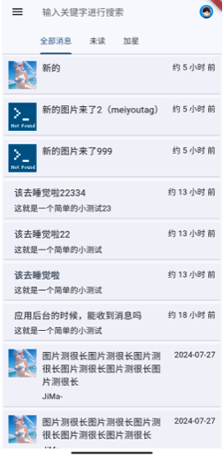
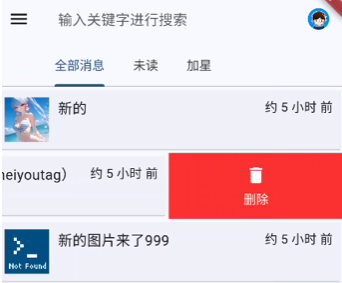
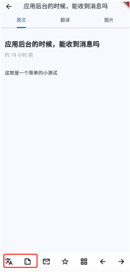
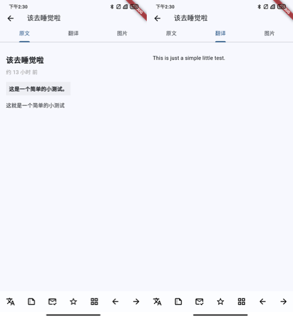
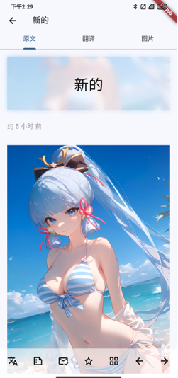
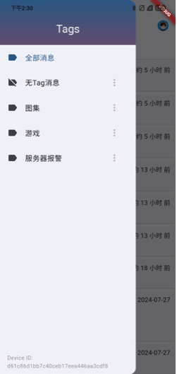

import { Callout } from 'nextra/components'

# User Manual
V1.0.15

## 1. Login
Before using this application, users need to log in. There are two ways to log in: manually entering or scanning the `SendKey`.

### Manually Enter `SendKey`:
- After launching the app, you'll automatically enter the login page.
- Enter your `SendKey` in the input box in the middle of the page.
- Click the "Login" button at the bottom of the page to log in.

### Scan QR Code for `SendKey`:
- On the login page, click the "Scan QR Code for `SendKey`" button.
- Use your phone's camera to scan the QR code to get the `SendKey`.
- The system will automatically fill the scanned `SendKey` into the input box.

- After confirming it's correct, click "Login" to continue.
- Upon successful login, the app will automatically navigate you to the main interface, showing your message list. If login fails, the app will display an error message; please check if your `SendKey` is correct.

## 2. Message List

After logging in, the main interface defaults to the message list page. This page lists all messages retrieved from the server via API, and automatically processes them as follows:
- **Message Preview**: Each message shows a title and preview of the content. If the message contains images, it will attempt to extract and display thumbnails.
- **Auto Update**: The app will fetch the latest messages from the server when starting up and when switching pages, updating the list.
- **Data Localization**: All messages retrieved from the server are stored in the local database, allowing you to browse and manage messages even without a network connection.

By default, all messages are listed, but you can filter by "Unread" or "Starred".

### Message Operations:
- **View Details**: Click any message to enter the message detail page.
- **Delete Message**: In the message list, swipe left on a message to reveal the delete option. Click "Delete" to remove the message from both the local database and server.

### Search Function:
There's a search box at the top of the message list that supports keyword search in message titles and content.

## 3. Message Reading
Clicking any message in the message list will take you to the message reading page. This page not only supports basic text display and image viewing but also provides rich interactive features and auxiliary tools.

### Basic Features:
- **Markdown Display**: Message content supports Markdown format, allowing formatted text, links, images, and other multimedia elements.

<Callout type="info">
1. ServerChan³ uses [flutter_markdown0.7.4](https://pub.dev/packages/flutter_markdown) to render Markdown.
1. Note that in Markdown, you need two line breaks `\n\n` for a new paragraph. HTML syntax is not supported, format like  is HTML and needs to be converted to Markdown format.
1. You can send HTML to AI for conversion help.
</Callout>

- **Summary and Translation**: Summary and translation buttons are provided at the bottom of the page. When clicked, the system will call the backend API to process the text and display the results on screen.

- **Image Mode**: If the message content contains image links, you can switch to image mode to view all related images.

### Dynamic Interface Elements:
- **Auto-hide Menu**: When you scroll down to read messages on the message reading page, the top navigation bar and bottom function menu will automatically hide to provide a larger reading area.
- **Show Menu Again**: When you scroll up, the top and bottom menus will reappear, allowing quick access to various functions such as translation, summary, mark as read/unread, etc.

### View and Operate Images:

- **Click Image for Full Screen**: In the message content, any recognizable image links will be formatted as clickable images. Click any image to expand it to full-screen view mode.

- **Full Screen Mode Interaction**:
  - **Download Image**: In full-screen mode, there will be a download icon (shown as a down arrow). Click this icon to automatically download the image to your device's gallery.
  - **Close View**: In full-screen mode, there's an "X" icon in the top right corner of the screen. Click this icon to exit full-screen mode and return to the message reading page.

## 4. Tag Grouping
Messages can be organized through Tags. Although this app doesn't support users adding, deleting, or editing Tags manually, you can filter messages by selecting existing Tags.

### Access Tag Selection:
- On the message list page, click the hamburger menu (three horizontal lines icon) in the top left corner to expand the sidebar, showing all Tags.
- **Select Tag to Filter Messages**: Choose a Tag in the sidebar, and the message list will only show messages related to that Tag.

Click the menu icon at the end of the Tag list item to further set Tag reading preferences.

## 5. Advanced Settings
In the settings page, users can make some advanced configurations, such as:
- **Clear Messages**: Users can choose to clear all messages or only clear unstarred messages.
- **Notification Settings**: Users can configure whether to receive new message notifications and the form of notifications.
- **Account Management**: Users can log out or update personal information.

### Access Settings:
- Click the settings icon (gear shape) in the top right corner of any page to enter the settings page.
- In the settings page, you can see different configuration options, including clearing messages and account management.

## Usage Tips
- Ensure the network connection is properly configured before use, so the app can retrieve data from the server.
- Don't share your `SendKey` to ensure account security.
- Use QR code login to avoid input errors and improve security. 