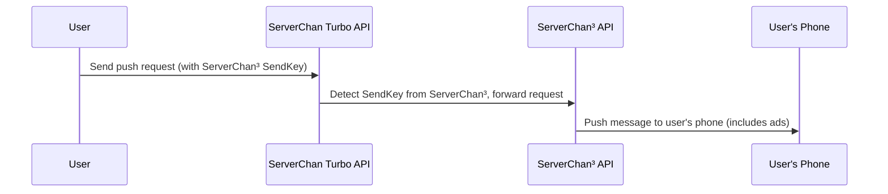

import { Callout } from 'nextra/components'

## Forwarding Service

[ServerChan³](https://sc3.ft07.com/) and [ServerChanTurbo](https://sct.ftqq.com/) use different user systems and SendKeys, making them incompatible within the system.

A practical issue is that most applications currently integrate with ServerChanTurbo, and although we are actively promoting integration with ServerChan³, this will still take a considerable amount of time.

Therefore, we have set up a **temporary** forwarding system that automatically forwards requests when it detects a SendKey from ServerChan³.

<Callout>
Please note:

1. This forwarding system is temporary and will be discontinued when the ServerChan³ ecosystem matures (maximum three years)
1. To encourage users and software developers to prioritize using ServerChan³'s official entry point, **content forwarded through this system will include advertisements**
</Callout>

## Best Practices

To improve your user experience, please:

1. For programs you develop yourself, use the [ServerChan³ official API endpoint](/serverchan3/server/api)
1. For software and services you are using, please **suggest to the developers** to support [ServerChan³ official API endpoint](/serverchan3/server/api).

<Callout type="info">
We provide [SDKs](/serverchan3/server/sdk) that **can support both ServerChanTurbo and ServerChan³**, making the transition cost very low.
</Callout> 