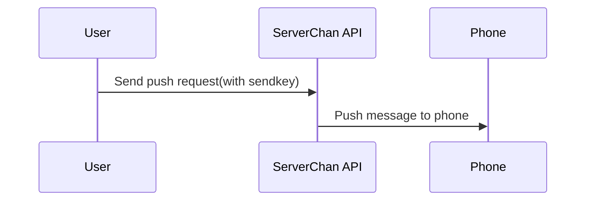
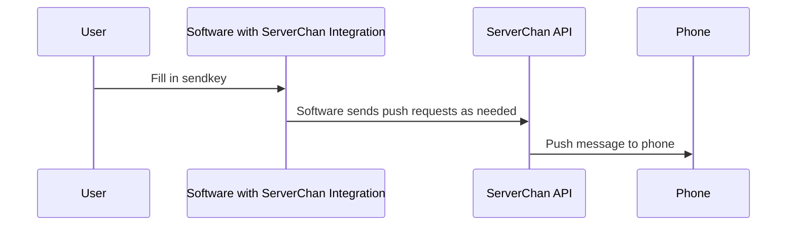
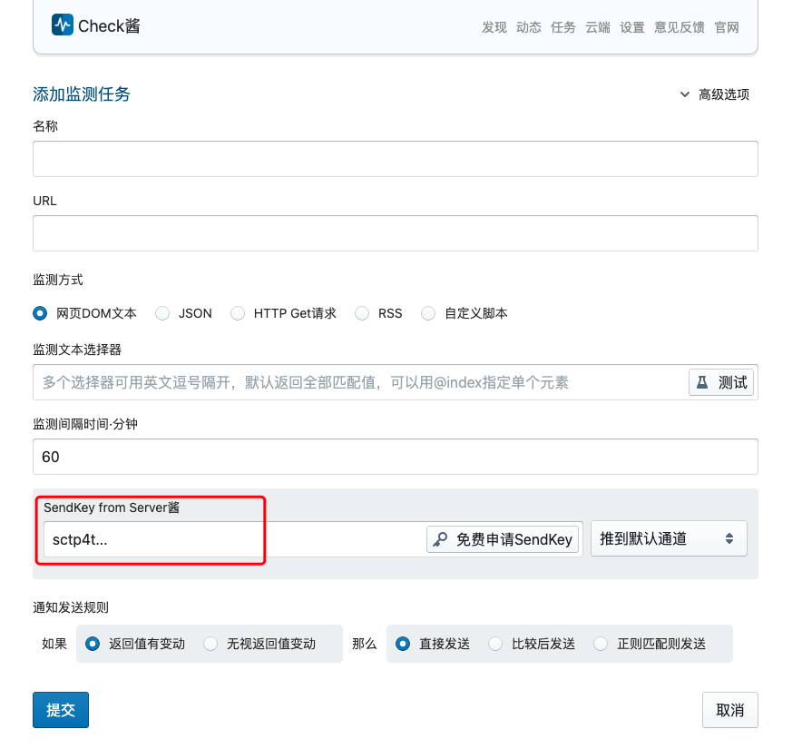

import { Callout } from 'nextra/components'

# ServerChan³ User Manual


<Callout emoji="🎈">
[ServerChan³](https://sc3.ft07.com/) and [ServerChan<sup>Turbo</sup>](https://sct.ftqq.com/) use different user systems and Sendkeys, they are **not interchangeable**
</Callout> 

## Quick Start

1. Log in to the website and get your `SendKey` from the [SendKey page](https://sc3.ft07.com/sendkey)
1. [Install and configure the APP](/serverchan3/app/install)*
1. Send messages through [API](/serverchan3/server/api) or [SDK](/serverchan3/server/sdk)
1. Or fill in your `SendKey` in software that has integrated ServerChan to let them send messages

<Callout type="info">
ServerChan³ focuses on APP push notifications, most phones can receive messages without background processes. If you want to push to other channels, such as WeChat (Test Account, Service Account), WeCom, DingTalk groups, Feishu groups, and WebHook, you can use [ServerChan<sup>Turbo</sup>](https://sct.ftqq.com/)
</Callout>

## What is ServerChan

ServerChan was originally a service developed for programmers to push alert messages to mobile phones by calling HTTP interfaces. However, users quickly discovered that it **can be used in various scenarios**, and more and more regular users started using it. After six to seven years of development, it now has over 200,000 users.

On the other hand, although the entire service mainly consists of one API, manually calling the API is always troublesome. Therefore, many software applications have integrated ServerChan - you just need to fill in your `SendKey` to use it. Currently, **over 2,000 open source projects** have integrated the ServerChan interface.

Therefore, we have two ways to use ServerChan:

1. Push directly through the API interface
1. Use through software that has integrated ServerChan

### Push Directly Through API Interface


#### Usage Example

```bash copy
curl "https://<uid>.push.ft07.com/send/<sendkey>.send?title=<title>&desp=<desp>"
```

<Callout type="info">
This method is more suitable for programmers. You can check the detailed API documentation, [SDK](https://github.com/easychen/serverchan-sdk), and [example code in various programming languages](https://github.com/easychen/serverchan-demo)
</Callout>


### Use Through Software with ServerChan Integration


<Callout type="info">
This method is more suitable for non-technical users. You can check the available software and their configuration methods.
</Callout>

#### Usage Example

Fill in your `SendKey` in CheckChan.

 