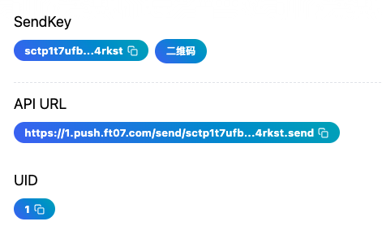

# API

The ServerChan series APIs adopt a minimalist style - you can send push notifications simply by entering a URL in your browser.

## API Endpoint

API URL: `https://<uid>.push.ft07.com/send/<sendkey>.send`

Where:

1. `uid` and `sendkey` can be obtained from the [SendKey page](https://sc3.ft07.com/sendkey)
1. `uid` can also be extracted from `sendkey`, located at `sctp{uid}t...`, regex pattern: `/^sctp(\d+)t/`
1. The `API URL` can also be directly copied from the [SendKey page](https://sc3.ft07.com/sendkey)

## Request Parameters

### Method

1. Both `POST` and `GET` are supported.
1. When using `GET`, place parameters in the `Query`. If parameter values contain Chinese or other non-letter characters, they need to be `urlencode` encoded. Line breaks also need to be `urlencode` encoded.
1. A simple example: `https://<uid>.push.ft07.com/send/<sendkey>.send?title=<title>&desp=<desp>`

### Encoding

When using `POST`, the following `Content-Type` are supported:

- application/json
- application/x-www-form-urlencoded
- multipart/form-data

The Body should use the corresponding format.

### Parameters

| Parameter    | Type    | Required | Description                                                 |
|-----------|---------|----------|------------------------------------------------------|
| `title` or `text`   | string  | Yes       | The title of the push notification. If not provided, the content of `text` will be used           |
| `desp`      | string  | No*       | The body content of the push notification. Required if `title` is not provided. Supports markdown (displayed in APP)  |
| `tags`    | string  | No       | List of tags, multiple tags separated by vertical bars                      |
| `short`   | string  | No       | A brief description of the push message, used to specify the content part of the message card, especially when pushing markdown content     |

## Usage Examples

Please visit our dedicated code repositories: [GitHub](https://github.com/easychen/serverchan-demo) · [Domestic Network Mirror: Gitee](https://gitee.com/easychen/serverchan-demo) 