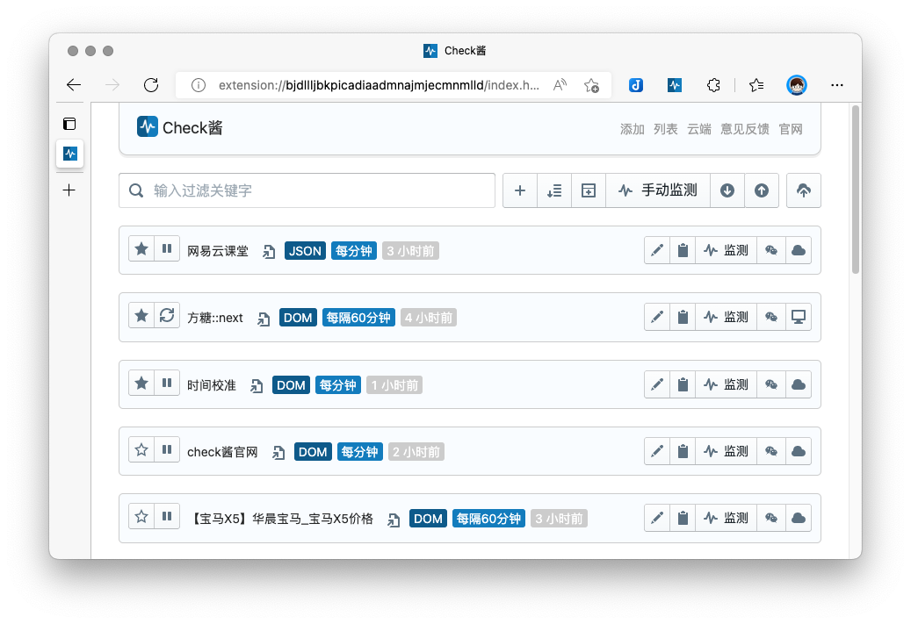
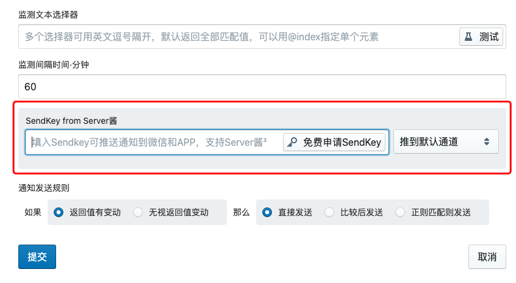

# Web Monitoring

## CheckChan

### Application Introduction

[CheckChan](https://ckc.ftqq.com/) is a general-purpose web content monitoring tool that can monitor changes in web page content and send notifications through ServerChan.

### Compatibility

- Compatible with ServerChan³ since version `0.9.23`

### How to Set Up

On the create task page, simply enter your `SendKey`.

 