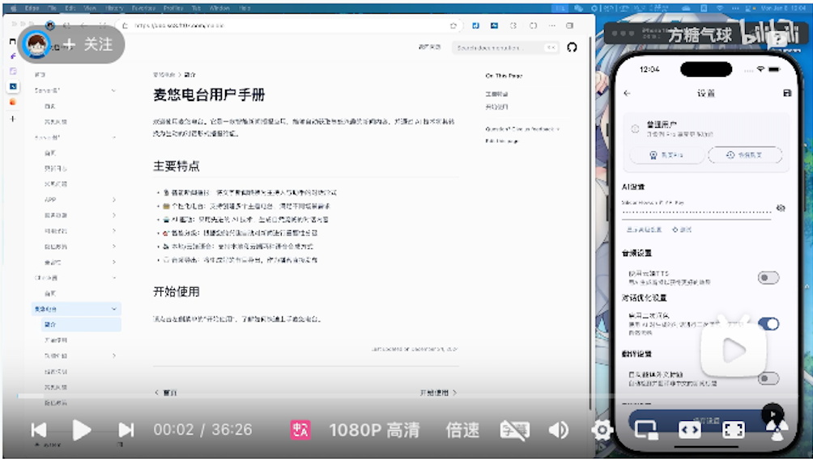

# 开始使用

## 第零步：安装应用

1. iOS请通过[AppStore安装](https://apps.apple.com/app/id6739451274)
1. Android请[下载APK](https://the7.ft07.com/Maidio/maidio-byok-0.1.6-b10.apk)手动安装

完全使用教程：[请移步B站](https://www.bilibili.com/video/BV1XFrjYGEh4)

## 第一步：设置 AI API Key

1. 点击顶部导航栏的"设置"标签
2. 在设置页面找到"AI 设置"部分
3. 输入您在 AI 平台的 API Key，
   - iOS 版目前支持：
      - [SiliconFlow.cn](https://cloud.siliconflow.cn/i/GKAoff2O): 国内领先的开源模型服务商，注册账号后可创建API KEY
   
   - Android 版目前支持：
      - [API2D](https://api2d.com/r/186008)：位于加拿大的一站式AI API分发和增值平台，注册账号后可创建API KEY，支持微信充值
      - [SiliconFlow.cn](https://cloud.siliconflow.cn/i/GKAoff2O): 国内领先的开源模型服务商，注册账号后可创建API KEY

4. 点击"保存"按钮完成设置

## 第二步：设置语音

1. 打开应用后，点击顶部导航栏的"语音"标签
2. 在"本地语音"页面:
   - 选择主持人和助理的语音引擎
   - 调整语速、音调和音量
   - 点击"声音"按钮可以试听效果
3. 如果是 Android 系统:
   - 请先在系统设置中安装中文语音包
   - 推荐使用[小米](https://www.52pojie.cn/thread-1683594-1-1.html)和[Google](https://play.google.com/store/apps/details?id=com.google.android.voiceservices)的语音引擎
   - 选择合适的中文语音
4. 如果是 iOS 系统：
   - 进入「设置」→「辅助功能」→「朗读内容」打开「朗读所选内容」
   - 「声音」→ 「中文」→「月/瀚」→ 下载高质量语音
   - 之后就可以在本地TTS中选择使用了（Yue/Han）看不到可以重启下应用
5. 云端语音需要在设置界面填写api key才能测试

## 第三步：创建电台

1. 打开应用后，点击主界面右上角的"+"按钮
2. 输入电台名称（例如：科技资讯、财经新闻等）
3. 添加 RSS 订阅源：
   - 直接输入 RSS 地址（每行一个）
   - 或导入 OPML 文件

## 第四步：获取新闻

1. 在主界面点击电台右侧的 RSS 图标
2. 点击右上角的刷新按钮，获取最新内容
3. 等待新闻加载完成

## 第五步：生成节目

1. 在新闻列表中选择感兴趣的新闻
2. 点击底部的"创建节目"按钮
3. 根据自己的兴趣选择每个新闻的喜好（等于节目的详细程度）
4. 等待 AI 生成对话内容

## 第六步：收听节目

1. 返回主界面，点击电台右侧的播放按钮
2. 享受 AI 主持人为您播报的新闻内容 