import { Callout } from 'nextra/components'

# 用户手册  
V1.0.15

## 1. 登录  
在使用本应用之前，用户需要进行登录。登录可以通过两种方式进行：手工输入或扫码输入`SendKey`。

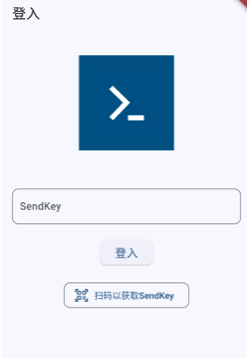

### 手工输入`SendKey`：
- 启动应用后，自动进入登录页面。
- 在页面中间的输入框中输入您的`SendKey`。
- 点击页面底部的“登入”按钮进行登录。

### 扫码输入`SendKey`：
- 在登录页面，点击“扫码以获取`SendKey`”按钮。
- 使用手机摄像头扫描二维码获取`SendKey`。
- 系统会自动填充扫描到的`SendKey`到输入框。

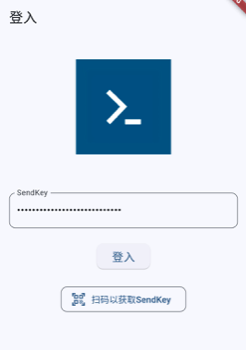

- 确认无误后，点击“登入”继续。
- 登录成功后，应用将自动将您导航至主界面，显示您的消息列表。如果登录失败，应用会提示错误信息，请检查您的`SendKey`是否正确。

## 2. 消息列表  

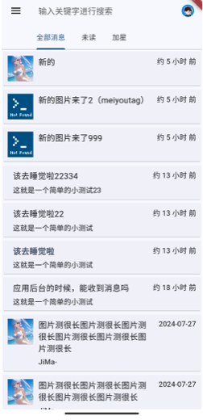

登录后，主界面默认显示的是消息列表页面。此页面列出了所有从服务器通过API获取的消息，并自动进行了以下处理：  
- **消息预览**：每条消息会显示标题和部分内容的预览，如果消息包含图片，将尝试提取并显示缩略图。
- **自动更新**：应用会在启动时和页面切换时从服务器获取最新消息，并更新列表。
- **数据本地化**：所有从服务器获取的消息都会存储到本地数据库中，即使在没有网络连接的情况下，也能浏览和管理消息。  

默认列出的是所有消息，可以点击「未读」、「加星」进行筛选。

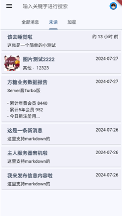

### 消息操作：  
- **查看详情**：点击任何一条消息，可以进入消息详情页面。
- **删除消息**：消息列表中，左滑消息可以显示删除选项，点击“删除”即可从本地数据库和服务器中删除该消息。

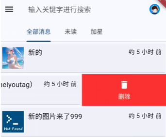

### 搜索功能：  
消息列表顶部有一个搜索框，支持输入关键字对消息标题和内容进行搜索。

## 3. 消息阅读  
在消息列表中点击任意消息，您将进入消息阅读页面。此页面不仅支持基本的文本显示和图片查看，还提供了丰富的交互功能和辅助工具。

### 基本功能：
- **Markdown显示**：消息内容支持Markdown格式，允许格式化文本、显示链接、图片等多媒体元素。

<Callout type="info">
1. Server酱³使用[flutter_markdown0.7.4](https://pub.dev/packages/flutter_markdown)渲染Markdown。
1. 注意在Makrdown中两次回车`\n\n`才是换行。不支持HTML语法， 这种格式是HTML，需要改成Markdown格式。
1. 可以把HTML发送给AI让其帮你转换。
</Callout>

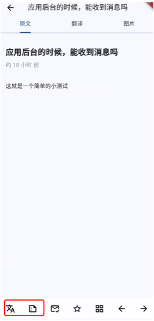

- **总结与翻译**：页面下方提供总结和翻译按钮。点击后，系统会调用后端API处理文本，并将结果展示在屏幕上。

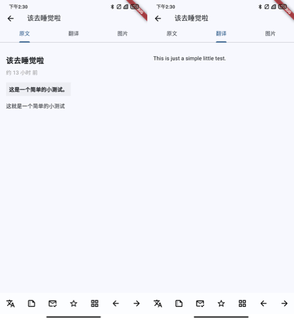

- **图片模式**：如果消息内容中包含图片链接，您可以切换至图片模式查看所有相关图片。

### 动态界面元素：
- **自动隐藏菜单**：当您在消息阅读页面向下滑动阅读消息时，顶部的导航栏和底部的功能菜单会自动隐藏，以提供更大的阅读区域。
- **重新显示菜单**：当您向上滑动时，顶部和底部的菜单会重新出现，允许您快速访问各种功能，例如翻译、总结、标记为已读/未读等。

### 查看与操作图片：

- **点击图片进入全屏模式**：在消息内容中，任何可识别的图片链接都将被格式化为可点击的图片。点击任何一张图片，应用将展开该图片至全屏查看模式。

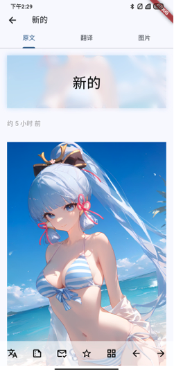

- **全屏模式交互**：
  - **下载图片**：在全屏模式下，会有一个下载图标（显示为一个向下箭头）。点击此图标，图片将自动下载到您的设备相册。
  - **关闭查看**：全屏模式中，有一个“X”图标位于屏幕右上角。点击此图标可以退出全屏模式，返回到消息阅读页面。

## 4. Tag（标签）分组  
消息可以通过Tag进行组织，虽然本应用不支持用户自行添加、删除或编辑Tag，但可以通过选择已有的Tag来过滤消息。

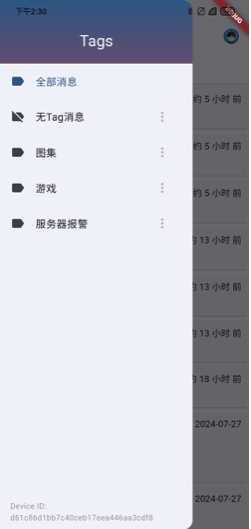

### 访问Tag选择：
- 在消息列表页面，点击左上角的汉堡菜单（三条横线图标），展开侧边栏，显示所有Tag。
- **选择Tag过滤消息**：在侧边栏中选择一个Tag，消息列表将只显示与该Tag相关的消息。

点击Tag列表项尾部的菜单图标，可以进一步设置Tag的阅读偏好。

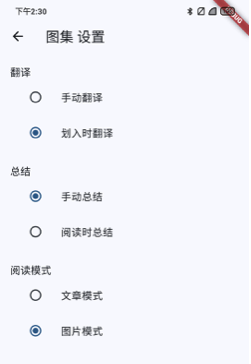

## 5. 高级设置  
在设置页面，用户可以进行一些高级配置，例如：
- **清除消息**：用户可以选择清除所有消息，或只清除未加星标的消息。
- **通知设置**：用户可以配置是否接收新消息通知以及通知的形式。
- **账号管理**：用户可以退出登录或更新个人信息。

### 访问设置：
- 在任何页面的右上角，点击设置图标（齿轮形状）进入设置页面。
- 在设置页面，可以看到不同的配置选项，包括清除消息和账号管理等。

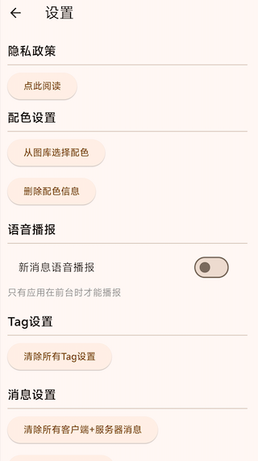

## 使用提示  
- 确保在使用前已正确配置网络连接，以便应用能够从服务器获取数据。
- 不要泄露您的`SendKey`，确保账号安全。
- 使用扫码登录可以避免输入错误，提高安全性。