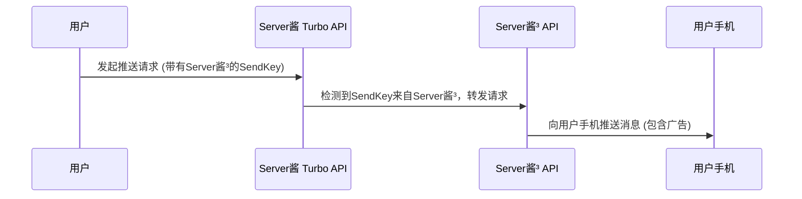

import { Callout } from 'nextra/components'

## 转发服务

[Server酱³](https://sc3.ft07.com/) 和 [Server酱Turbo](https://sct.ftqq.com/) 采用不同的用户系统和SendKey，因此无法在系统内部进行兼容。

一个现实问题是，目前市面上的应用主要整合的是Server酱Turbo，虽然我们在努力推送对Server酱³的整合，但这依然需要很长的时间。

因此，我们架设了一个**临时**转发系统，当它发现SendKey来自Server酱³时，会自动将其转发。

<Callout>
请务必注意：

1. 这个转发系统是临时的，当Server酱³的生态成熟后，会停止使用（最长三年）
1. 为了让用户和软件作者优先使用Server酱³的官方入口，**本系统转发的内容会添加广告**
</Callout>

## 最佳实践

为了提升您的使用体验，请：

1. 对您自己开发的程序，请使用[Server酱³官方API入口](/serverchan3/server/api)
1. 对您在使用的软件和服务，请**向开发方建议**兼容[Server酱³官方API入口](/serverchan3/server/api)。

<Callout type="info">
我们提供了[SDK](/serverchan3/server/sdk)，**可以同时兼容Server酱Turbo和Server酱³**，替换起来成本很低。
</Callout>

