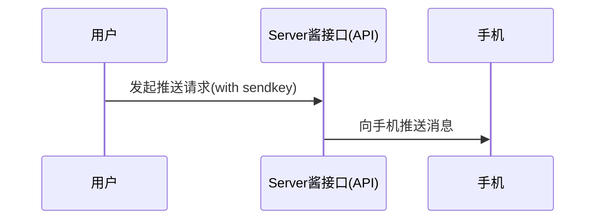
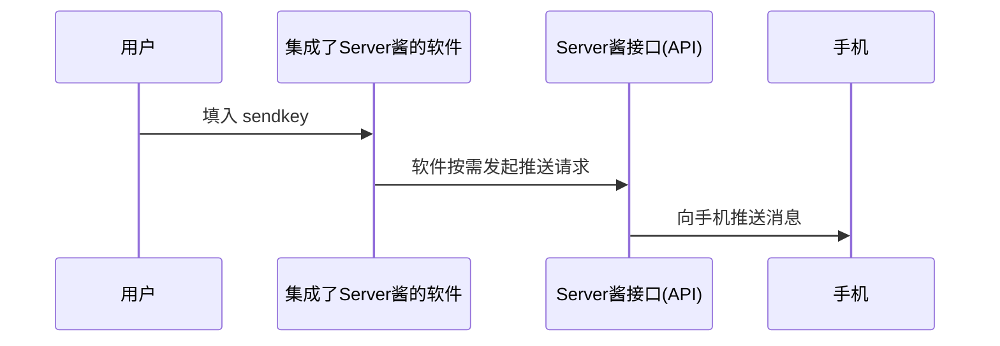

import { Callout } from 'nextra/components'

# Server酱³ 使用说明书


<Callout emoji="🎈">
[Server酱³](https://sc3.ft07.com/) 和 [Server酱<sup>Turbo</sup>](https://sct.ftqq.com/) 采用不同的用户系统和Sendkey，两者**不通用**
</Callout> 

## 省流版

1. 登入网站，在[SendKey页面](https://sc3.ft07.com/sendkey)获得`SendKey`
1. [安装并配置APP](/app/install)*
1. 通过[API](/server/api)或者[SDK](/server/sdk)调用消息发送接口
1. 或者将`SendKey`填入已集成软件，让软件来调用接口发送消息

<Callout type="info">
Server酱³专注于APP推送，大部分手机无需驻留后台亦可收信。如果想推送到其他通道，比如微信（测试号、服务号）、企业微信、钉钉群、飞书群以及WebHook，可使用[Server酱<sup>Turbo</sup>](https://sct.ftqq.com/)
</Callout>

## 什么是Server酱

Server酱原本是一个为程序员开发的、调用HTTP接口往手机推送报警消息的服务，但很快用户们发现，它**可以用到各种场景**,于是越来越多的普通用户开始使用它。经过六七年的发展，已经拥有超过20万的用户。

另一方面，虽然整个服务主要就一个API，但手动调用API总是麻烦的。于是很多软件都集成了Server酱，只需要填入`SendKey`，就可以使用。目前，**超过2000个开源项目**整合了Server酱接口。

因此，我们有两种方式使用Server酱：

1. 通过API接口直接推送
1. 通过集成了Server酱的软件使用

### 通过API接口直接推送


#### 使用示例

```bash copy
curl "https://<uid>.push.ft07.com/send/<sendkey>.send?title=<title>&desp=<desp>"
```

<Callout type="info">
此方式更适合程序员，可以查看API的详细说明、[SDK](https://github.com/easychen/serverchan-sdk)和[各种语言的调用示例代码](https://github.com/easychen/serverchan-demo)
</Callout>


### 通过集成了Server酱的软件使用


<Callout type="info">
此方式更适合非技术用户，可以查看可用软件及其配置方法。
</Callout>

#### 使用示例

在Check酱中填入`SendKey`。


