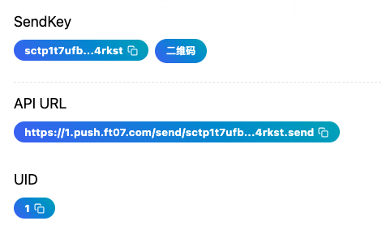

# API

Server酱系列API均采用极简风格，仅仅在浏览器中输入URL就可以发送推送。

## 接口地址

API地址： `https://<uid>.push.ft07.com/send/<sendkey>.send`。

其中：

1. `uid`、`sendkey`可以从[SendKey页面](https://sc3.ft07.com/sendkey)获得
1. `uid`亦可从`sendkey`中提取，位于`sctp{uid}t...`处，正则为`/^sctp(\d+)t/`
1. `API URL` 亦可直接在[SendKey页面](https://sc3.ft07.com/sendkey)复制

## 请求参数

### 方法

1. `POST`和`GET`都支持。
1. 使用`GET`时，将参数放入`Query`中，如果参数值为中文或其他非字母字符，需要使用`urlencode`进行编码，换行符也需要`urlencode`编码
1. 一个简单示例：`https://<uid>.push.ft07.com/send/<sendkey>.send?title=<title>&desp=<desp>`

### 编码

使用`POST`时，支持以下`Content-Type`：

- application/json
- application/x-www-form-urlencoded
- multipart/form-data

Body请使用对应的格式。

### 参数

| 参数名    | 类型    | 必填 | 描述                                                 |
|-----------|---------|----------|------------------------------------------------------|
| `title` or `text`   | string  | 是       | 推送的标题，如果未提供则使用 `text` 的内容           |
| `desp`      | string  | 否       | 推送的正文内容，如未提供 `title`，则为必填，支持markdown（在APP中显示）  |
| `tags`    | string  | 否       | 标签列表，多个标签使用竖线分隔                      |
| `short`   | string  | 否       | 推送消息的简短描述，用于指定消息卡片的内容部分，尤其是在推送markdown的时候     |

## 调用示例

请移步专门的代码仓库：[GitHub](https://github.com/easychen/serverchan-demo) · [国内网络镜像：Gitee](https://gitee.com/easychen/serverchan-demo)