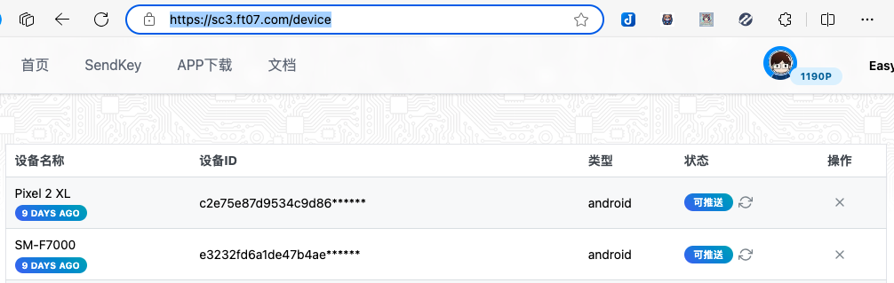
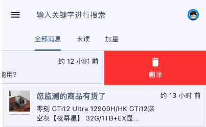

# 常见问题

<strong>Server酱³是免费的吗？如果不是，将如何收费吗？</strong>

Server酱³同时包含推送服务和AI服务。不同的服务有不同的收费模式：

1. 推送服务在**测试期间免费**，正式版将开始收费，收费标准和Server酱Turbo(sct.ftqq.com)一致。Server酱Turbo的订阅会员**无需重复付费**，届时我们会提供一个方案将会员时间可以同步到Server酱³上。
2. AI相关功能(如摘要和翻译)，**无论是否测试期，均会消耗点数**([费用说明](https://apijia.cn/doc))，新注册用户有赠送点数，用完后需自行充值购买。

<strong>Server酱³（sc3.ft07.com）和Server酱Turbo(sct.ftqq.com)有什么关系？</strong>

- Server酱³是一个全新的产品线，专注于**自有客户端体验**，目前已经支持AI摘要、翻译和读图模式，还有以Tag为主的消息分组方案。
- Server酱Turbo则着重于以微信为主的**多通道推送**。

两者的用户、SendKey**不通用**。接口上，除了Server酱³的API URL中，将需要在域名中添加`uid`，绝大部分参数兼容Server酱Turbo。

<strong>xx软件可以使用Server酱³吗？</strong>

理论上，只有兼容了Server酱³接口的软件才支持，但我们提供了一个从SCT到SC3的转发服务，使得暂时所有支持SCT的软件理论上都可以支持Server酱³。

[请点此查看关于转发的详细说明](./compatibility/sct-forward)。

<strong>Server酱³是否支持多设备？如何管理注册过的设备</strong>

Server酱³支持多设备，默认情况下会对所有注册过的设备进行推送。你可以在官网的「[设备管理](https://sc3.ft07.com/device)」页面对设备进行删除、启用/停止推送等管理。

<strong>Server酱³如何删除消息？如何一次删除全部消息？</strong>

1. 按住消息向左滑动，会出现删除按钮，再次点击即可删除单条消息。
1. 点击消息列表页面右上角的菜单，进入设置页面。在「消息设置」中点击「清除所有客户端+服务器消息」即可

<strong>Server酱³中的「客户端消息」和「服务器消息」是什么？有何不同？</strong>

1. 这和Server酱³的运行方式有关，消息首先推送达到服务器，并缓存72小时
1. 然后客户端启动和刷新时，从服务器拉取消息，并保存到本地数据库
1. 消息列表页面显示的是本地数据库的消息，这样即使不联网，也能浏览历史消息
1. 设置中的「仅清除客户端消息」点击后，刷新可以从服务器端再次拉取消息；而「清除所有客户端+服务器消息」则同时删除服务器上的缓存消息，其他客户端亦无法拉取

<strong>Server酱³如何选择性的批量删除消息？</strong>

1. 将不想删除的消息加星。
1. 点击消息列表页面右上角的菜单，进入设置页面。在「消息设置」中点击「清除所有未加星消息」即可

<strong>Server酱³如何将所有消息标记为已读？</strong>

1. 点击消息列表页面右上角的菜单，进入设置页面。在「消息设置」中可以看到「全部标记为已读」按钮。
1. 如果你的设置页面没有此按钮，请升级到[最新版本](https://sc3.ft07.com/client)。

<strong>推送消息时如何换行？是否支持表格？格式是什么</strong>

1. Server酱³使用[flutter_markdown0.7.4](https://pub.dev/packages/flutter_markdown)渲染Markdown，支持[Makrdown语法](https://daringfireball.net/projects/markdown/)，但不允许HTML。 这种格式是HTML，需要改成Markdown格式。
1. 注意在Makrdown中两次回车`\n\n`才是换行。
1. 可以把HTML发送给AI让其帮你转换。

<strong>推送消息时如何附带图片？</strong>

1. Server酱³不支持base64作为图片的URL，需要自行将图片上传到网络获得可访问的URL，然后再使用Markdown语法，通过`desp`参数推送。注意其他参数不支持Markdown，且只在消息详情页面显示。

<strong>推送消息时 `desp` 参数采用了Makrdown，消息卡片上看起来很乱，怎么办？</strong>

1. 可以通过 `short` 参数指定消息卡片中内容部分显示的具体文字。
1. 可参考[API文档](/serverchan3/server/api)中的参数部分。

<strong>消息Tags如何删除或者编辑？</strong>

1. 消息Tags由消息包含的标签自动聚合生成
1. 删除掉全部包含某Tag的消息，Tag即会消失
1. 同样的，因为来自自动聚合，所以无法手动修改Tag名称

{/*

<strong></strong>

*/}
